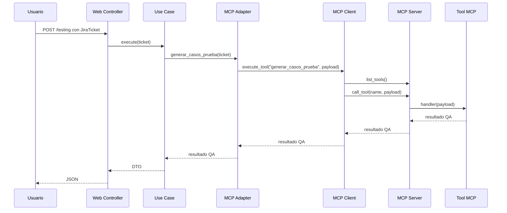

# Arquitectura Hexagonal en QA Copilot MCP

## Regla Principal

Las dependencias apuntan hacia adentro:

```text
Web -> Application -> Domain
MCP Adapter -> Application/Domain contracts
Domain -> no depende de infraestructura
```

## Capas

### Domain

Contiene `JiraTicket` y los puertos. Esta capa define el lenguaje central del negocio QA.

### Application

Contiene los casos de uso. Cada caso expresa una acción concreta:

- `GenerarCasosPruebaUseCase`
- `GenerarCriteriosUseCase`
- `AnalizarRiesgosUseCase`
- `EstimarEsfuerzoUseCase`

### Infrastructure MCP

Simula el patrón MCP:

- `MCPServer.register_tool()`
- `MCPServer.list_tools()`
- `MCPServer.call_tool()`
- `MCPClient.discover_tools()`
- `MCPClient.execute_tool()`

### Web

Expone FastAPI y un dashboard moderno. Es un adaptador de entrada, no contiene reglas de negocio.

## Flujo Detallado


